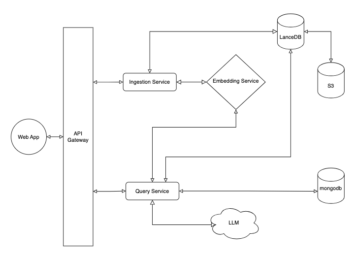

# Example RAG

A Retrieval-Augmented Generation (RAG) system for journal entries using LanceDB as the vector database. Designed to mirror AWS serverless architecture locally using Docker.

## Architecture

See at [https://naeemgitonga.com/articles/example-rag](https://naeemgitonga.com/articles/example-rag?fromWebsite=readme-in-repo)
